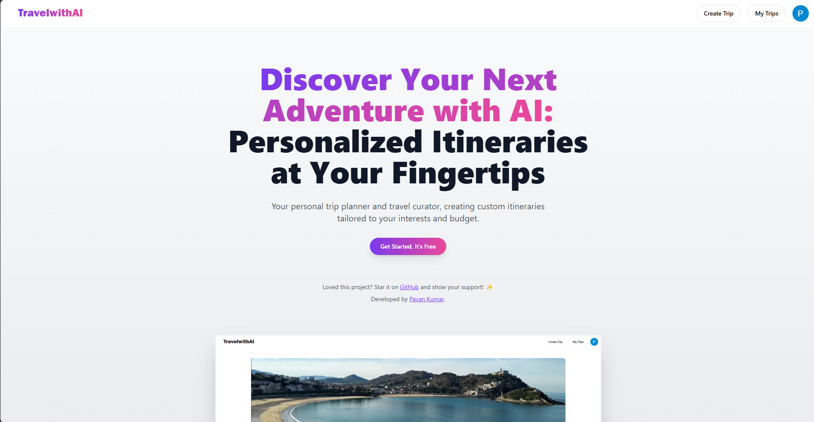
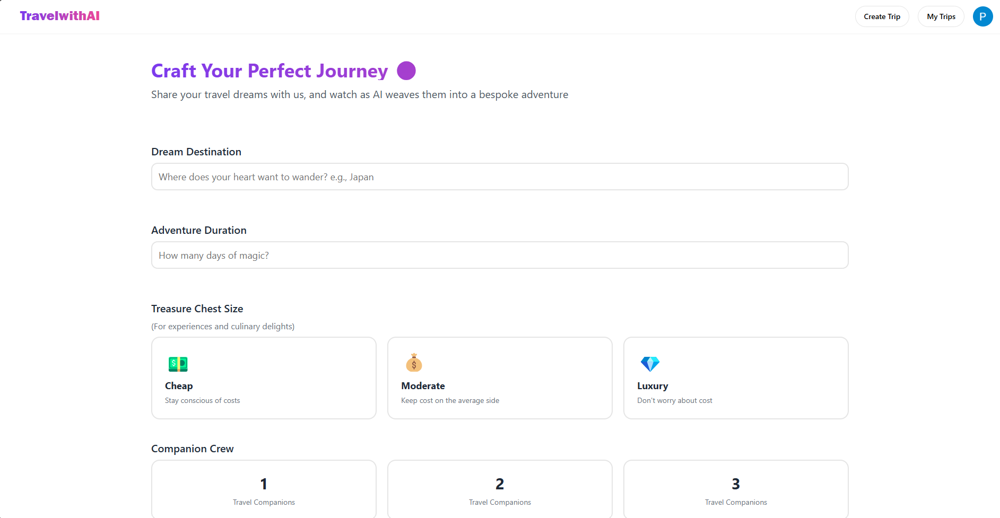
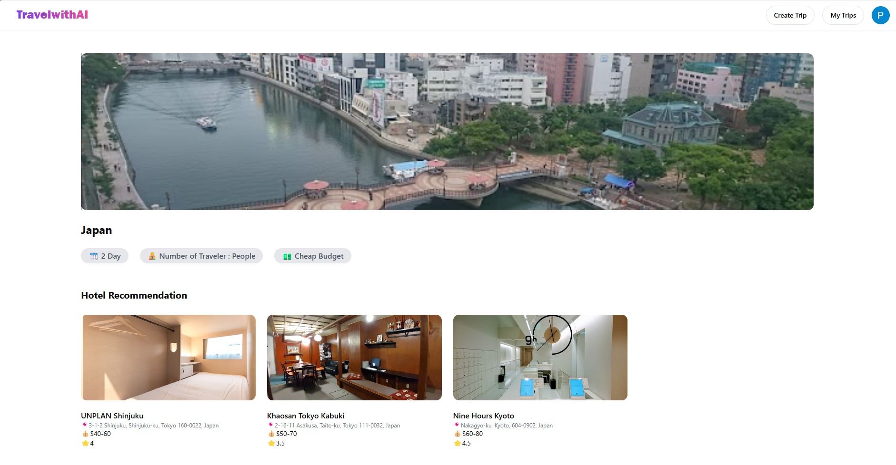

# TravelwithAI - Full Stack AI Trip Planner

**TravelwithAI** is a full-stack web application designed to help users plan their trips using AI-powered recommendations. The application integrates **Google Gemini AI**, **React**, **Firebase**, **OAuth**, and **Google Maps** to provide a seamless trip planning experience. It also includes scraped images for enhanced visuals and is hosted on **Vercel**.

---

## Features

- **AI-Powered Trip Planning**: Utilizes Google Gemini AI to generate personalized trip recommendations.
- **User Authentication**: Integrated with Google OAuth for secure user login.
- **Interactive Maps**: Google Maps integration for location-based planning.
- **Trip Management**: Users can create, view, and manage their trips.
- **Responsive UI**: Built with **React** and **Tailwind CSS** for a modern and responsive design.
- **Image Integration**: Scraped images and custom visuals for an engaging user experience.

---

## Screenshots

Here are some screenshots of the application:

### Landing Page


### Trip Planning Page


### Trip Details Page



---

## Tech Stack

- **Frontend**: React, Tailwind CSS
- **Backend**: Firebase (Authentication, Firestore)
- **AI Integration**: Google Gemini AI
- **Authentication**: Google OAuth
- **Hosting**: Vercel

---

## Project Structure

```
Full-Stack-AI-Trip-Planner/
├── public/                # Static assets (images, logos, etc.)
│   ├── image1.png
│   ├── image2.png
│   ├── image3.png
│   ├── landing.png
│   ├── logo.svg
│   └── road-trip-vacation.jpg
├── src/                   # Source code
│   ├── components/        # Reusable UI components
│   ├── constants/         # Constants and configuration
│   ├── create-trip/       # Trip creation module
│   ├── lib/               # Utility functions
│   ├── my-trips/          # User trip management module
│   ├── service/           # API and Firebase services
│   ├── view-trip/         # Trip viewing module
│   ├── App.jsx            # Main application component
│   ├── main.jsx           # Entry point
│   └── index.css          # Global styles
├── .env                   # Environment variables
├── .gitignore             # Git ignore file
├── package.json           # Project dependencies
├── README.md              # Project documentation
└── vercel.json            # Vercel configuration
```

---

## Environment Variables

To run this project, you will need to add the following environment variables to your `.env` file:

```plaintext
VITE_GOOGLE_GEMINI_AI_API_KEY=
VITE_GOOGLE_AUTH_CLIENT_ID=
```

---

## Installation

1. Clone the repository:
   ```bash
   git clone https://github.com/pavankumar2004/TravelwithAI.git
   ```
2. Navigate to the project directory:
   ```bash
   cd Full-Stack-AI-Trip-Planner
   ```
3. Install dependencies:
   ```bash
   npm install
   ```
4. Start the development server:
   ```bash
   npm run dev
   ```

---

## Hosting

The application is hosted on **Vercel**. You can visit the live site [here](https://travelwithai.vercel.app).

---

## Contributing

Contributions are welcome! Please follow these steps:

1. Fork the repository.
2. Create a new branch (`git checkout -b feature/YourFeatureName`).
3. Commit your changes (`git commit -m 'Add some feature'`).
4. Push to the branch (`git push origin feature/YourFeatureName`).
5. Open a pull request.

---

## License

This project is licensed under the **MIT License**. See the [LICENSE](LICENSE) file for details.

---

## Acknowledgments

- **Google Gemini AI** for powering the trip recommendations.
- **Firebase** for backend and authentication services.
- **Vercel** for seamless hosting and deployment.

---

Enjoy planning your trips with **TravelwithAI**! 🌍✈️

